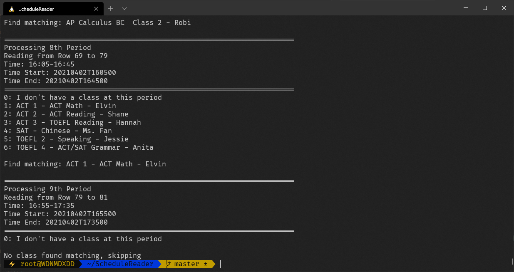

# ScheduleReader

注意⚠️：本项目不再维护，请移步[2.0](https://github.com/Asiimoviet/ScheduleReader2.0)版本！！！

| 本项目只是个人使用，基本不会有维护和更新，不符合格式的可以fork一份自己随便改改就能用了（虽然会改的应该也能自己写）

在受够了手打了课程表以后写了这个程序，基本就是可以把老师发下来的课表转换成icalendar格式。目前各大主流平台基本都可以使用本格式


### 依赖库
- Pandas
- iCalendar

如何安装：
```
pip3 install -r requirements.txt
```

### 如何使用
1. 安装好Python 方法自行谷歌
2. 安装好依赖
```
pip3 install -r requirements.txt
```
3. 对课程表进行微调：看下方
4. 在[config.json](https://github.com/Asiimoviet/ScheduleReader/blob/master/config.json)设置星期一的日期（每一周都要）以及选课, 见下方
5. 运行程序
```
python3 ssap.py schedule.xlsx config.json
```
6. 导出文件[result.ics](https://github.com/Asiimoviet/ScheduleReader/blob/master/result.ics)

### 课程表格式要求
首先需要吧你们年级的课表移动到第一个sheet
需要让第二和第四列充满时间，默认排版中第四列第九节课是没有时间的要自己调整
每个cell里面课程的格式应该是"名字 - 教室"，名字中可以包含 - ，对于类似班会课那样的特殊格请自行调整。
具体格式参考[schedule.xlsx](https://github.com/Asiimoviet/ScheduleReader/blob/master/schedule.xlsx)

### 选课格式
用list添加到[config.json](https://github.com/Asiimoviet/ScheduleReader/blob/master/config.json)中的classes下
每个选课必须有唯一性，比如说如果Computer Science有两个班，则必须把后面的Class给带上
具体格式可以参考[config.json](https://github.com/Asiimoviet/ScheduleReader/blob/master/config.json)

